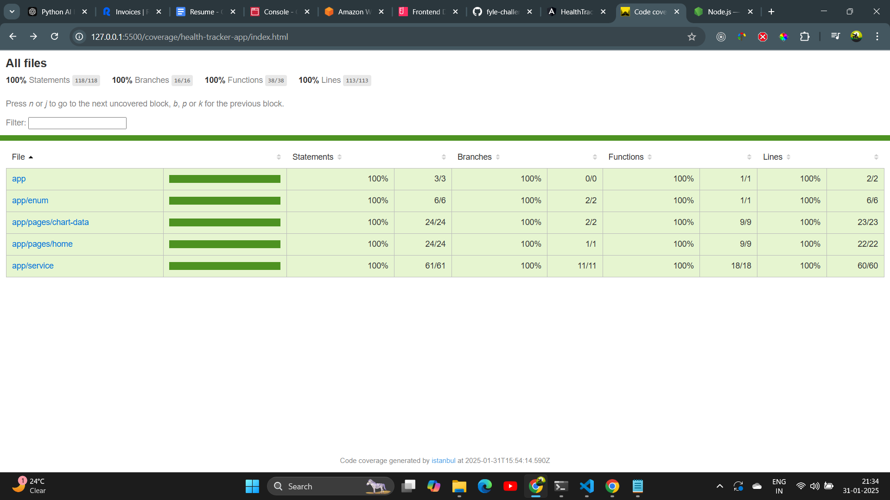

# Health Challenge Tracker

Health Challenge Tracker is a user-friendly application designed to help users keep track of their workout routines. Users can add their names, select different types of workouts, and log the duration of each workout in minutes. The app provides an organized way to monitor various workouts, ensuring users can easily see their progress and maintain their fitness goals. With features like local storage support, it remembers users' workout details, making it convenient to continue tracking over time.

This project was generated with [Angular CLI](https://github.com/angular/angular-cli) version 16.2.0.

# Prerequisites

you must have npm and node js on your machine. For installing this [Node js](https://nodejs.org/en/download)

# Live URL

https://health-tracker-app-six.vercel.app/

## Assignment Details

I have implemented this assignment using the Angular framework only, as instructed. I have also written test case for 1 service and 1 component. Along with this I have implemented charts.js for better data visualization.

## Features

- **Add Workout detail**: You can easily add the user, workout type, and minutes with a button .
- **Display Details**: Details is displayed as a table grid.
- **Search By Name**: Easily search user name by entering keywords or phrases.
- **Filter By Workout Type**: There is an an option to filter by workout type
- **User-Friendly Interface**: Intuitive and responsive user interface for seamless navigation and interaction.

## How to use this software

- When you open this page (https://health-tracker-app-six.vercel.app/) so you are on workout details add and workout details listing page. Here you can add workout details.

## Technologies Used

- **Angular**: Frontend framework used for building the application.
- **HTML/CSS/JavaScript**: Standard web technologies for structuring, styling, and scripting the application.
- **Tailwind CSS**: Used Tailwind css for modern appealing UI

## I have written Test Case for

**Test Coverage**

This project includes 100% code coverage for the following:

- **Component**: `HomeComponent`
- **Component**: `ChartDataComponent`
- **Service**: `HelperService`

# running the test coverage

Run `npm run coverage`

For more details, see the [coverage report](./coverage/health-tracker-app/index.html).

## Installation

To run GitGallery locally, follow these steps:

1. Clone the GitGallery repository to your local machine.
   git clone https://github.com/yadavritik467/health-tracker-app.git

2. Navigate to the project directory.
   cd health-tracker-app

3. Install dependencies using npm.
   npm install

4. Start the development server.
   npm start

5. Open your web browser and visit `http://localhost:4200` to view the application.
